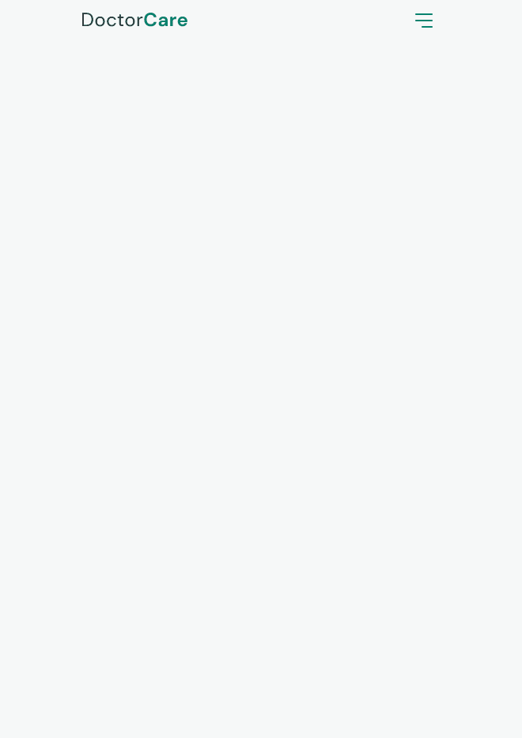

# 💚 DOCTORCARE

This is my first REAL commit. This project was created using my early skills with HTML, CSS and JavaScript.
I create this landing page just to learn and see how works this threes tools together and challenge me to create something nice :)

This Landing Page was created to introduce the initials concepts of Front-End, when I use HTML, CSS and JS to create the page. 

# 🎯 PHASES

✔️ Mobile First ;\
✔️ HTML - Structuring and specifying the sections ;\
✔️ CSS - styling the sections and making the page more accessible ;\
✔️ JS - creating animations for page scrolling and in the testimonials section ;\
✔️ DESKTOP - and finally, making the page more acessible via desktop ;

# 🪄 ABOUT THE ANIMATIONS

I use the [ScrollReveal](https://scrollrevealjs.org/) lib to create the reveal animations when you scroll the page.

To make the carousel in the testimonials section, I use the [Swiper](https://swiperjs.com/) lib to create animations and the pagination of the every testimonial.

# 🚀 ABOUT THE PROJECT 

This project was create with the NLW Return, project create by Rocketseat to introduce people to dev career.

